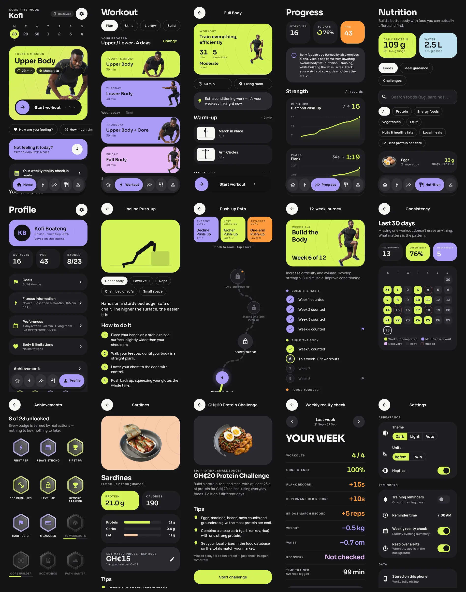
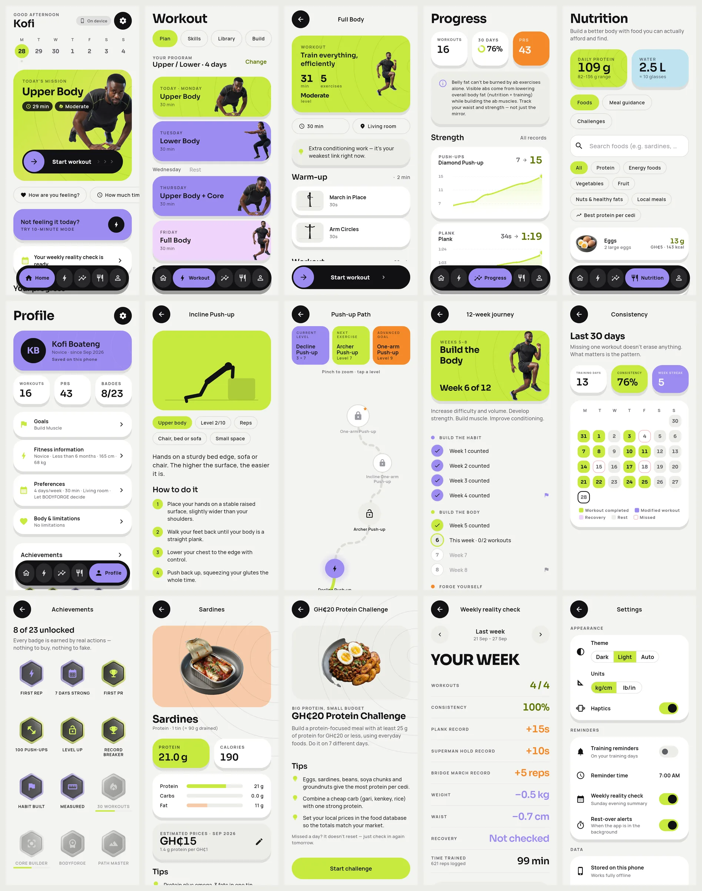

# BODYFORGE

A free, personalised home-fitness app built on bodyweight only. It needs no gym, no equipment, no subscription and no paid AI.
Workouts adapt to you after every session. Everything works offline, and an account (optional) backs up and syncs your data through Supabase.

- **Flutter** (Material 3, custom design system: see `DESIGN.md`) · **Riverpod** · **go_router**
- **drift / SQLite** for offline-first storage, with a sync queue.
  Most data syncs last-write-wins on `updated_at`; workout logs merge by union.
- **Supabase**: Auth, Postgres and Row Level Security. Only the public anon/publishable key goes in the app.
- **fl_chart**, **flutter_animate** and code-drawn exercise demos (`lib/features/exercise/figure_*.dart`)
- **flutter_local_notifications** for training reminders, the weekly check and rest-over alerts

| Dark (default) | Light |
|---|---|
|  |  |

*Rendered by `test/widgets/screenshots_test.dart` on a 360×780 dp phone with 5 weeks of demo data.*

---

## 1. Run it (offline, no setup)

Requirements: Flutter 3.47+ (Dart 3.13+) and an Android or iOS device/emulator.

```bash
cd bodyforge
flutter pub get
dart run build_runner build --delete-conflicting-outputs   # generates the drift database code
flutter run
```

Without Supabase settings the app runs **fully on the device**. Tap *Get started* and your data stays on the phone.

## 2. Turn on accounts & sync (optional)

1. Create the config file. It is gitignored, so it will never be committed:

   ```bash
   cp env/bodyforge.env.example.json env/bodyforge.env.json
   ```

   Fill in `SUPABASE_URL` and `SUPABASE_ANON_KEY` from **Project Settings → API**. Use the anon/**publishable** key.
   **Never use the `service_role` / secret key in the app.**

2. Set up the database. You run these yourself; nothing in this repo touches your project automatically.

   **Option A: Dashboard.** In **SQL Editor**, run `supabase/migrations/20260928000001_bodyforge_schema.sql`, then run `supabase/seed.sql`.

   **Option B: Supabase CLI.**
   ```bash
   supabase link --project-ref <your-project-ref>
   supabase db push                                   # applies supabase/migrations
   psql "<your connection string>" -f supabase/seed.sql
   ```

   The migration only *creates* objects and never drops or truncates anything. The seed is an idempotent upsert of reference data (114 exercises, 6 skill paths / 54 nodes, 32 foods, 4 challenges, 23 achievements), so it is safe to re-run.

3. Configure Auth in the dashboard:
   - **Authentication → Providers → Email**: enabled. If *Confirm email* is on, the app tells new users to check their inbox before logging in.
   - **Authentication → URL Configuration**: set the Site URL. The password-reset email links there.

4. Run with the config:

   ```bash
   flutter run --dart-define-from-file=env/bodyforge.env.json
   ```

   People who started offline can create an account later (**Profile → Create account**). Their local data is re-keyed and uploaded.

### What the migration creates

- **Reference tables** (read-only to users): `exercises`, `skill_paths`, `skill_nodes`, `nutrition_items`, `challenges`, `achievements`.
- **User tables**, each with RLS so a user can read and write only rows where `user_id = auth.uid()`:
  `profiles`, `goals`, `programs`, `program_days`, `workouts`, `workout_sets`, `personal_records`, `measurements`, `skill_progress`, `recovery_checks`, `challenge_progress`, `challenge_checkins`, `user_achievements`, `journey_progress`, `milestones`, `food_prices`, `sync_metadata`.
- **Triggers**:
  - `synced_at` stamping, which is the pull cursor.
  - A last-write-wins guard, so an older `updated_at` never overwrites a newer row.
  - A rule keeping the earliest achievement unlock.
- **`delete_my_account()` RPC** (authenticated users only). It deletes the caller's auth user, and their rows cascade.

If you change the in-app catalogs, regenerate the seed with `dart run tool/generate_seed.dart`.

## 3. Tests

```bash
flutter analyze                          # clean
flutter test --exclude-tags monkey       # unit + app smoke tests (~30 s)
flutter test --tags monkey               # "tap everything" UI sweep (several minutes)
```

| Suite | What it covers |
|---|---|
| `test/domain/*` | Adaptive progression and regression, early unlocks, session building, time fitting, recovery adjustments, environment filtering, weakest link, PR detection, achievements, the journey (week repeats and phases), calendar, weekly reports, and player timers surviving an app kill. |
| `test/data/*` | Sync queue: push/pull, last-write-wins both ways, union merge of workout logs, tombstones, earliest unlock, local → account re-keying. Training service end to end: onboarding, completing workouts, progression, records, export. |
| `test/widgets/app_smoke_test.dart` | Boots the real app on a 360 dp phone and covers: welcome; full onboarding to a saved plan; all 33 routes with an empty profile, with 5 weeks of history, and in light theme with reduced motion; a quick session swiped to start, played to the end, rated and saved. |
| `test/widgets/tap_everything_test.dart` | On each main screen, taps every button, card, chip and switch one at a time, and fails on any exception or error widget. |
| `test/widgets/screenshots_test.dart` | Renders the main screens in both themes to PNG: `BF_SCREENSHOT_DIR=/tmp/shots flutter test test/widgets/screenshots_test.dart`. |
| `test/widgets/exercise_figure_test.dart` | Every exercise demo renders and animates. Set `BF_RENDER_DIR` to get a contact sheet. |

## 4. Project layout

```
lib/
  app/        config, router, providers, auth, sync controller, notifications, settings
  core/       design tokens, theme, motion system, shared widgets, asset registry, units
  domain/     pure Dart: models, catalogs (exercises, skill paths, foods, challenges,
              achievements) and the engine (program generator, session builder,
              adaptive engine, recovery, time fitter, journey, records, reports, player)
  data/       drift database, repositories, sync engine + Supabase store, services
  features/   screens: onboarding, home, player, workout, progress, journey,
              nutrition, profile/settings, achievements, exercise demos
supabase/     migration + generated seed
tool/         seed generator
```

## 5. Debug-only demo data

In **debug builds**, **Settings → Developer → Load 5 weeks of demo data** fills the app with simulated workouts, records and measurements for review. This option does not exist in release builds.
