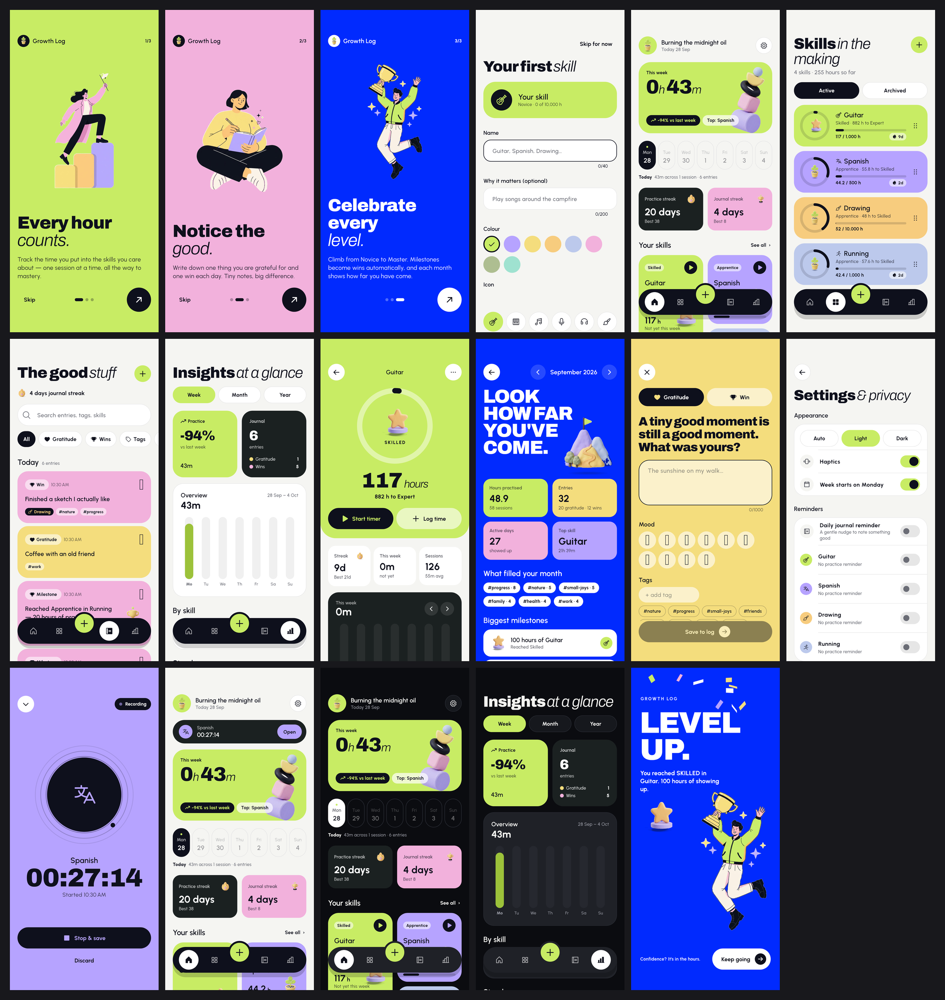

# Growth Log

A skill tracker (10,000-hours style) and a gratitude & wins journal in one offline Flutter app.



- **Skills:** create/edit/archive/delete skills, log practice manually or with a live timer that
  survives backgrounding, the app being killed and reboots. Levels Novice → Apprentice (20 h) →
  Skilled (100 h) → Expert (1,000 h) → Master (10,000 h) with a level ring and a full-screen
  celebration. Milestones at 1, 5, 10, 20, 50, 100, 250, 500, 1k, 2.5k, 5k, 10k hours auto-log a win.
  Weekly/monthly charts, streaks, session history with edit/delete/undo, per-skill daily reminder.
- **Journal:** gratitude and win entries with mood, tags and an optional linked skill; timeline
  grouped by day with search and filters (type, tags, skill, date range); logging streak; daily
  reminder with a different gentle prompt each day.
- **Insights:** week/month/year trends, per-skill breakdown, streaks, top tags, and a monthly
  "Look how far you've come" recap with a highlight reel and a shareable image card.
- **App:** onboarding + first-skill setup, light/dark/auto theme, app lock (PIN + biometrics),
  JSON export/import, reset, haptics. Everything is stored locally in SQLite — no account, no network.

## Run it

Requirements: Flutter **3.47+** (Dart 3.13), Android SDK 36 / Xcode 16+.

```bash
cd growth_log
flutter pub get
flutter run                 # on a connected device or emulator
```

Demo data: in a **debug** build open *Settings → Developer → Seed demo data*. The section does not
exist in release builds.

Release build:

```bash
flutter build apk --release        # Android (uses the debug signing key — add your own before publishing)
flutter build ipa                  # iOS (set your team in Xcode first)
```

Regenerating code/assets after changes:

```bash
dart run build_runner build          # drift database code (lib/core/db/database.g.dart)
python3 tool/process_assets.py       # cut out + resize artwork from assets_src/generated
dart run flutter_launcher_icons      # app icons from assets/images/brand
dart run flutter_native_splash:create
```

## Tests

```bash
flutter analyze                              # clean
flutter test                                 # unit + database + end-to-end widget flows
flutter test test_screenshots --update-goldens   # re-render the 17 screen PNGs in test_screenshots/goldens
```

| Suite | What it covers |
|---|---|
| `test/domain/levels_test.dart` | Level thresholds, progress within a band, max level, milestone lists and titles |
| `test/domain/streaks_test.dart` | Current/longest streaks, alive-until-midnight rule, gaps, month/year/leap boundaries, clock moved backwards, DST-safe day maths, week start |
| `test/db/skill_repository_test.dart` | Skill CRUD + validation, archive (disables reminder, stops timer), delete cascade keeps journal entries, reorder, session validation (1 min–24 h, no future), update/move, delete + undo, reactive streams |
| `test/db/milestone_timer_test.dart` | Auto-win on milestones, idempotency, back-filling logs one win, un-reaching removes auto wins but never edited ones; timer survives "process death", one timer at a time, <1 min saves nothing, clock going backwards, midnight crossing, 24 h cap, custom duration, deleting a skill stops its timer |
| `test/db/entry_backup_test.dart` | Tag normalisation, filters (type/tag/skill/date/text), very long text, update/prune/undo, backup round-trip, invalid backups rejected without touching data, lock state never restored from a backup |
| `test/widget/app_flow_test.dart` | Onboarding → first skill → home; empty states on every tab; quick-add log → milestone win; write + search an entry; timer across restart → saved session; app lock PIN gate |
| `test_screenshots/` | Renders every screen with real fonts/images (used for the design review) |

## Project structure

```
lib/
  main.dart, app.dart              bootstrap, theme, router, lock gate, notification taps, lifecycle
  core/
    application/app_actions.dart   use-cases spanning repos + notifications + haptics
    db/                            drift schema, database, reactive multi-table watch helper
    domain/streaks.dart            pure streak maths
    services/                      notifications, app lock, haptics
    theme/                         tokens, ThemeData, type scale, vendored Phosphor icons
    utils/                         day keys (timezone-safe dates), formatting, injectable clock
    widgets/                       design-system components
    router.dart, providers.dart
  features/
    onboarding/  home/  shell/  skills/  timer/  log/  insights/  settings/  lock/
      data/ (repositories)  domain/  application/ (Riverpod providers)  presentation/
test/  test_screenshots/  tool/process_assets.py  assets_src/ (original artwork)
```

## How the tricky parts work

- **Timer that survives being killed:** only the start instant is stored (`active_timers` table).
  Elapsed time is always `now − startedAt`, so there is nothing to lose. On Android an ongoing
  notification with a native chronometer keeps counting while the app is closed and is restored
  on next launch if it was swiped away. Timers left running are capped at 24 h and the stop sheet
  lets you correct the duration.
- **Time zones & date changes:** every session/entry stores the *local calendar day* it happened
  on (`dayKey` = yyyymmdd). Streaks and charts use that key, so travelling never reshuffles
  history. "Today" ticks over at midnight and is re-checked on resume; reminders are rescheduled
  when the device time zone changes.
- **Milestones:** after any session change, reached milestones are reconciled with the skill's
  total. New ones are recorded and auto-log a win; if hours are deleted, un-reached milestones and
  their untouched auto wins are removed (a win you edited is yours and stays).
- **Deleting a skill:** the dialog offers Archive (keeps everything) or Delete (removes sessions
  and milestones). Journal entries linked to the skill are kept; the link is cleared.
- **Backups:** JSON with a format version; imports are validated first and applied in one
  transaction, so a bad file never destroys existing data. The app-lock state never travels
  with a backup (the PIN lives in the device keychain/keystore).
- **App lock:** 4-digit PIN stored as a salted, 20k-round SHA-256 hash in secure storage;
  biometrics optional with the PIN as fallback; 5 wrong tries → 30 s cooldown; re-locks after
  30 s in the background.

## Known limitations

- **Not run on a real device yet.** The build environment used for development had no Android SDK
  or iOS toolchain (and no network access to fetch one), so native builds, notifications,
  biometrics and share sheets are verified by code review against each plugin's setup docs, not
  on hardware. See the device checklist below.
- The journal reminder schedules the next 14 days (each with its own prompt). If the app isn't
  opened for two weeks the reminders pause until the next launch. Skill reminders repeat forever.
- On iOS the "timer running" notice is a one-off notification (iOS has no ongoing
  notifications); the timer itself still survives the app being closed.
- Stopping the timer from the notification isn't supported — tapping it opens the timer screen.
- The launcher icon, adaptive icon and splash mark are derived from the Apprentice badge art;
  the dedicated `onboarding_track` illustration wasn't generated, so onboarding uses the other
  three characters (see `ASSETS.md`).
- The share card and fonts are English-only; no localisation yet.

## Device checklist (please run through once)

- [ ] Install, complete onboarding, create a skill with a reminder → permission prompt appears.
- [ ] Start a timer, swipe the app away, wait, reopen → time kept; ongoing notification counts (Android).
- [ ] Stop timer → session saved; crossing 1 h shows a milestone snackbar, 20 h shows the level-up screen.
- [ ] Journal reminder fires at the chosen time with a prompt; tapping it opens a new entry.
- [ ] Enable app lock → PIN, then biometrics; background > 30 s → lock screen.
- [ ] Export backup → file saved; Reset; Import → data restored.
- [ ] Recap → Share card → share sheet with the PNG.
- [ ] Toggle dark mode; change device time zone and reopen → history unchanged.
